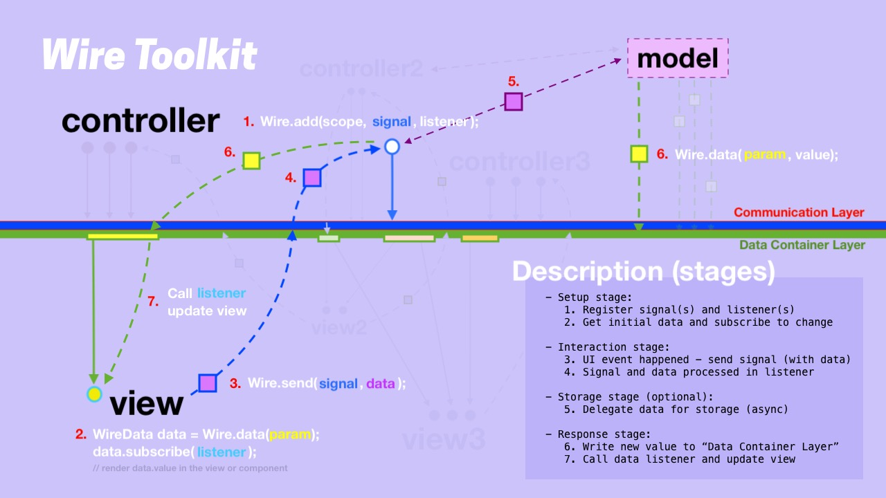
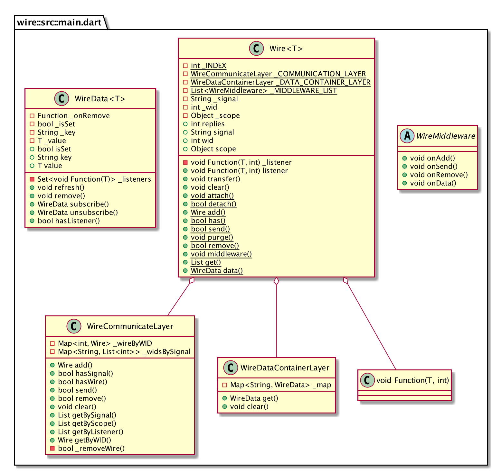

# Wire - communication and data layers
### Library aimed to decouple UI from business logic


It is a container for communication layer or a "bus" to which you can attach an instance of Wire and then listen for signal associated with it. Wire has a simple and intuitive API - `Wire.add` and `Wire.send`. Another layer a "data container" - `Wire.data`, it works as key-value in-memory storage, where value is an object, an instance of `WireData` that holds dynamic data and can be subscribed for updates. This "data container" was inspired by the idea of database Redis.

WireData also has Flutter Widget - **WireDataBuilder**: https://pub.dev/packages/wire_flutter. And [Haxe](https://haxe.org/) version can help to compile or better say transpile code of the library (with business logic as shared part) in one of the following language: **JavaScript, Java, C#, C++, HL, Lua, PHP**: [Wire Haxe](https://github.com/wire-toolkit/wire_haxe) (work in progress).

## Goal
The idea of this library is to decouple business logic or any logic that makes decisions on data processing from UI - this allows to have shared code that can be reused on any platform regardless of how a UI is looked like. 

## General Concepts
A software system consists in leveraging three main concepts:
1. Data storage and distribution.
2. Events listening and propagation.
3. Decision making based on that data.

You find these concepts in every computer program. Basically it's called - Model-View-Controller - meta-pattern or idea of separating program on functional pieces. Understanding MVC is about understanding how programs should work.
 
### Model
Data structure and the way how to access data define how an application works and how to apply changes. Therefore data definition is the first step in software development. All starts with data. MVC and the fact that Model is in the first position emphasize it as well. Models in application play a wider role than just value objects definition, it's also a way of how these objects will be stored and retrieved, it's a place responsible for this functionality, you can think of it as a data API - create, update, delete and etc. Does it make any decisions on how to modify the data? Probably not, maybe only update related data (e.g. in-memory counter of completed todos). And don't forget that there are two types of models - active and passive, one can notify when changes have occurred (active) and another is a plain storage or database (passive) - it has to be monitored by a controller or another agent. 
```dart
TodoVO create(String text, String note) {
    final todoVO = TodoVO(uuid(), text, note, false);
    final listData = Wire.data(TodoDataParams.LIST);
    final todoList = listData.value as List;
    final count = Wire.data(TodoDataParams.COUNT).value as int;

    todoList.add(todoVO.id);
    Wire.data(todoVO.id, todoVO);
    Wire.data(TodoDataParams.LIST, todoList);
    Wire.data(TodoDataParams.COUNT, count + 1);

    _save();

    print('> TodoModel -> created: ' + todoVO.id + ' - ' + todoVO.text);
    return todoVO;
}
```
`Wire.data('key')` plays a role of active model, it holds `WireData` instances associated with string keys, `WireData` is a container with dynamic data (accessed from `.value` property) and it can be monitored for updates by subscribing to it - `WireData.subscribe((value) => { ... })`. To update the value and notify listeners just set the value: `Wire.data('key', value)`. That's simple. In this case passive model is everything else around `Wire.data`, and it's up to you to decide from where the value (`WireData.value`) will be updated either from separate entity, a model by calling its data API (together with physical storing in database or sending to a server) or you can do it  from controller afterwards when sub-processes will be ended.

### View
UI also could have its own state - visual state, and it might not need to be stored in persistent storage at all, only temporarily. Example - accordion’s opened tab, or button hover state, tooltips, input highlight and etc. These states might depend on domain's data and are generated in run-time based on some conditions. Yes, view could have logic inside, but it must be simple branching conditions and only depends on data passed in and not derived from multiple sources, if it’s not then it's a sign that refactoring is needed. With `Wire` view consume data from data container layer - `Wire.data(value)`, then view subscribe to updates and re-render when change will happen - `WireData.subscribe((value) => { ... })`. 
```dart
class TodoCountView extends DomElement {
  TodoCountView(SpanElement dom):super(dom) {
    var wireData = Wire.data(TodoDataParams.COUNT);
    var update = (value) => dom.firstChild.text = value.toString();
    wireData.subscribe(update);
    update(wireData.value);
  }
}
```
But not every program has a view, servers might not have UI, and it all depends on the definition of the view. Saying View we mean something that can emit external events about outside world or interaction, and incoming network traffic cover this definition very well, and in this case Wire can be a distribution gate for network API calls, just call `Wire.send(signal, dto)` on network events and every part of internal system can react to it. `Wire.send` is a communication layer - a way to completely separate parts of the application. View sends signals and waits for data to be updated. Other parts of the view can listen for signals as well and update themselves accordingly. `Signal` is a basic string constant.  

### Controller
 Decision making - business logic - the rules, the controller - it's the place where data meet events mixed with other data, compared and distributed to the model for CRUD operations and views update. 
 > We believe and promote the idea that's view is 'just' the UI layer, with the real app being the logic and data kept outside the components tree.

<sub align="right">from original article [Thoughts on React Hooks, Redux, and Separation of Concerns](https://blog.isquaredsoftware.com/2019/07/blogged-answers-thoughts-on-hooks/)</sub>

Based on this belief we recommend to keep all your business logic, all data processing and decision making logic outside of a view - controllers is the only right place to do that. Signal listeners placed inside controller. You register a signal by adding it to the communication layer with `Wire.add(scope, signal, listener)`. Many signals can be connected to the same listener and vice versa. The listener should follow the specification of WireListener and has two params - wire instance first and dynamic data second. 
```dart
class TodoController {
    TodoModel todoModel;
    TodoController(this.todoModel) {
    
    Wire.add(this, TodoViewSignal.INPUT, (Wire wire, data) {
      var text = data as String;
      print('> TodoProcessor -> TodoViewSignal.INPUT: ' + text);
      if (text != null && text.isNotEmpty) {
        todoModel.create(text);
        Wire.send(TodoViewSignal.CLEAR);
      }
    });
    
    Wire.add(this, TodoViewSignal.DELETE, (Wire wire, data) {
      var todoId = data as String;
      print('> TodoProcessor -> TodoViewSignal.DELETE: ' + todoId);
      todoModel.remove(todoId);
    });
  }
}
```
In controller you make a decision of how to process input data, then it delegated to a model(s), stored or sent to the server, then controller might initiate reaction - send another signal or if data in data container layer was not updated in the model then controller might update them manually (from `Wire.data(key, value)`). Application might have multiple controllers each responsible to its particular data processing. You might think of them as reducers from Redux world, but more “advanced” interacting with services and models.

## Wire in Flutter / [WireDataBuilder](https://pub.dev/packages/wire_flutter)
Having business logic separated from presentation and data being distributed from shared layer (Wire.data) it's now possible to consume the data in UI easily. This means that in Flutter we can leave visual hierarchy, UI rendering and transitions between screens/pages to the Flutter framework, and consume data in places where it's needed, and do this with special widget - `WireDataBuilder({Key key, String dataKey, Builder builder})` which subscribe with a string `dataKey` to WireData value changes and rebuild underlying widget you pass to `builder` when value updated. However if you need only data in place you still can get it directly with `Wire.data('key').value`. Here is an example from [Todo ](https://github.com/wire-toolkit/wire_flutter/tree/master/example/wire_flutter_todo) application:
Here is Wire in Flutter
```dart
class StatsCounter extends StatelessWidget {
  StatsCounter() : super(key: ArchSampleKeys.statsCounter);
  @override
  Widget build(BuildContext context) {
    return Center(
      child: WireDataBuilder<int>( // <----- Subscribe to update
        dataKey: DataKeys.COUNT, // <------ Data key (string)
        builder: (context, notCompletedCount) {
          var allTodoCount = Wire.data(DataKeys.LIST).value.length; // <---- Access data without listening for its change
          var numCompleted = allTodoCount - notCompletedCount;
          return Column(
            mainAxisAlignment: MainAxisAlignment.center,
            children: [
              ...
```

# API
### Wire (static methods):
```
Wire .add(Object scope, String signal, WireListener listener, [int replies = 0])
bool .send(String signal, [dto]) // DTO stands for Data Transfer Object
bool .remove(String signal, {Object scope, WireListener listener})
bool .has({String signal, Wire wire})
void .attach(Wire wire)
bool .detach(Wire wire)
bool .purge()
void .middleware(WireMiddleware value)
List<Wire> .get({String signal, Object scope, Function listener, int wid})

WireData .data(String key, [dynamic value])
```

### WireListener:
Definition of listener to a signal in `Wire.add(scope, signal, listener)`
To get signal use `Wire.get(wid:wid).single`
```
void Function(dynamic data, int wid)
```

### WireData:
It is a data container that holds dynamic value. WireData can be subscribed (and unsubscribed). It's associated with string key and retrieved from internal storage with `Wire.data(key)`. WireData can't be null and `Wire.data(key)` will always return WireData instance. Initial value can null (if first call does not have value) and special property of WireData `isSet` is false until not null value is set for the first time. To remove value from data container use method `remove` - it emit null value before remove all subscribers, use `isSet` property to to distinguish between newly created (false) and removed.
```
WireData subscribe(WireDataListener listener)
WireData unsubscribe(WireDataListener listener)
void refresh()
void remove()
```

### WireDataListener:
Definition of WireData listener in `WireData.subscribe(scope, listener)`
```
void Function(dynamic value)
```

### WireMiddleware:
Class that extends WireMiddleware's methods can be added to `Wire.middleware(middleware)`
```
abstract class WireMiddleware {
  void onAdd(Wire wire);
  void onSend(String signal, [data]);
  void onRemove(String signal, [Object scope, WireListener listener]);
  void onData(String param, dynamic prevValue, dynamic nextValue);
}
```



Generate UML with `dcdg` (PlantUML): `pub global run dcdg -o ./uml/configuration`

## Examples
### 1. Counter (web):
- Open IDEA
- Select build target - Dart Web, point to example/counter/index.html
- Run Debug

### 2. Todo MVC (web and [Flutter](https://github.com/wire-toolkit/wire_flutter/tree/master/example/wire_flutter_todo)):

- Open IDEA
- Select build target - Dart Web, point to example/todo/index.html
- Run Debug

### 3. API calls variations (console):
- Open IDEA
- Select build target - Dart Command Line App, point to example/api/wire_api_example.dart
- Run Debug

## Licence

```
Copyright 2020 Vladimir Cores (Minkin)

Licensed under the Apache License, Version 2.0 (the "License");
you may not use this file except in compliance with the License.
You may obtain a copy of the License at

   http://www.apache.org/licenses/LICENSE-2.0

Unless required by applicable law or agreed to in writing, software
distributed under the License is distributed on an "AS IS" BASIS,
WITHOUT WARRANTIES OR CONDITIONS OF ANY KIND, either express or implied.
See the License for the specific language governing permissions and
limitations under the License.
```
